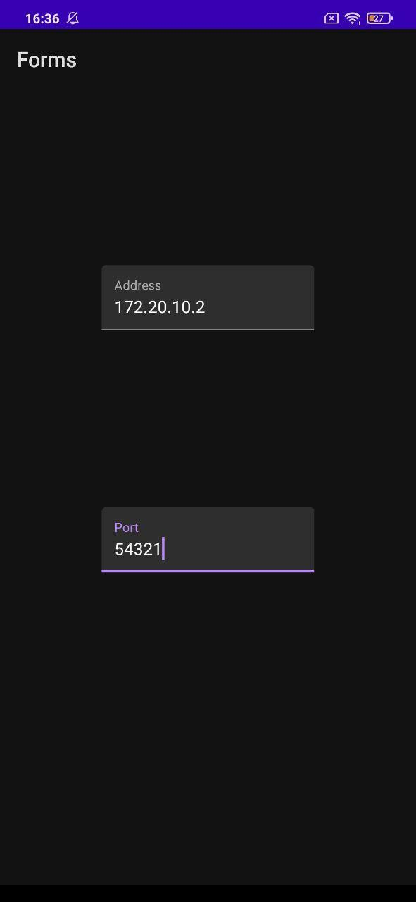

# Отчёт по работе КИС

## Использованные инструменты

Сервер:
- Python 3 (3.9.1)
- SQLite
- PyCharm Community Edition

Клиент (Android):
- Java
- Android Studio Community Edition

## Схема работы клиент-серверной системы

### Сокеты

В работе системы используются потоковые сокеты (`SOCK_STREAM`). Для однозначного определения конца сообщения (так как данные принимаются как поток) используется последовательность `\n\n`.


### Формат сообщений

Сообщение представляет собой json-объект, сериализованный в строку в кодировке UTF-8, с двумя символами `\n\n` в конце (используемыми для определения конца сообщения).

Сообщение ответа содержит следующие поля:
- "success": отражает успешность выполнения запроса (true или false).
- "error_msg": текст ошибки; задаётся только в случае ошибки при выполнении запроса, при этом в поле "success" задаётся false.
- "payload": возвращаемые данные (для select) в формате json-массива.

Сообщение запроса содержит следующие поля:
- "type": тип запроса, возможные варианты: `select`, `insert`, `delete`.
- "table": целевая таблица, возможные значения: `students`, `professors`, `courses` (интерфейс не предоставляется для остальных таблиц).
- "payload": список данных, используемых в запросе; например, для select: 
  - 1-й элемент - поле для оператора `WHERE`.
  - 2-й элемент - значение для оператора `WHERE`.

## Схема базы данных

- Departments - кафедры (факультеты, отделения)
- Subjects - предметы
- Groups - группы обучения
- Students - студенты
- Professors - преподаватели
- Courses - учебные курсы
- Grades - оценки студентов по курсам


## Запуск сервера

Для запуска сервера нужно перейти в папку с ним (`server.py`). Например:
```
C:
cd socket-client-server
cd server
```  
Запустить `server.py` через (неинтерактивный) интерпретатор Python, например, так:  
```
python server.py
```  
В одной папке с `server.py` должен находиться файл базы данных `data.db`. Без него сервер создаст новую базу данных со всеми таблицами, но без данных.  
Стабильная работа сервера с Python версии ниже 3.9.1 не гарантируется.  
Если после запуска программа ничего не выводит в консоль, значит, сервер находится в режиме ожидания соединения. В таком случае клиент может подключиться к серверу по его адресу в той же локальной сети. Используется порт `54321`.

## Подключение к серверу (клиент Android)

Первый экран при запуске приложения - настройка соединения. Два текстовых поля: адрес и порт. После ввода необходимо нажать Enter. При успешном соединении клиент получит и выведет список студентов.

Первая версия клиента позволяет получить полные списки студентов и преподавателей. После успешного соединения приложение сразу получит и выведет список студентов. Можно переключаться между таблицами студентов и преподавателей. Общение с сервером происходит в отдельном потоке и не блокирует пользовательский интерфейс. Тем не менее, приложение выводит нескрываемый диалог "Получение данных" с кнопкой "Отмена", позволяющей прервать выполняемую операцию.



